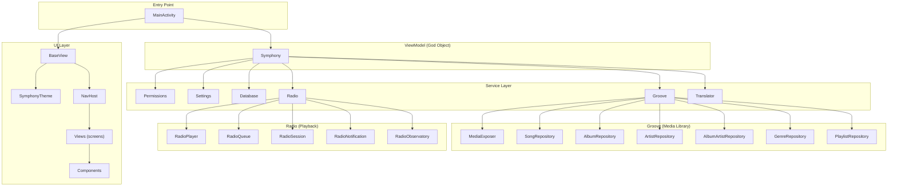
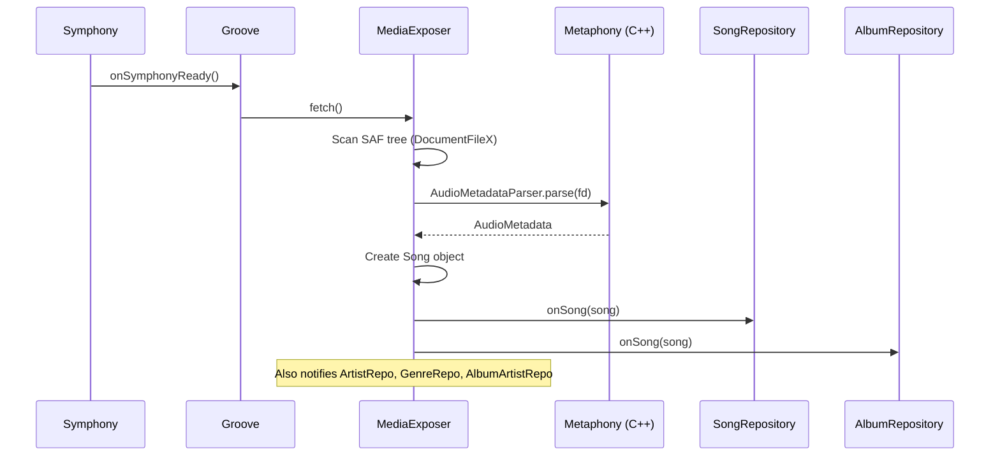
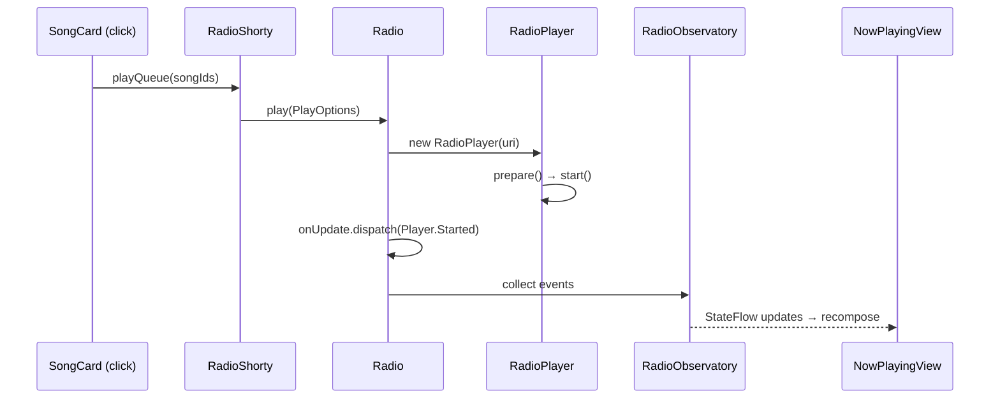

# Symphony AI — Developer Onboarding Guide

> **Purpose**: Everything a developer (or AI agent) needs to know before writing code for this project. Read this first.

---

## 1. What Is Symphony?

Symphony is a **lightweight, offline Android music player** built with **Kotlin** and **Jetpack Compose**. It targets Android 9+ and focuses on filename/path-based organization. The project is licensed under AGPL-3.0.

Key capabilities:
- Scans device storage for audio files (SAF-based, no MediaStore)
- Parses metadata via a custom native C++ library (`metaphony`) or Android's `MediaMetadataRetriever`
- Playback with gapless support, fade effects, sleep timer, speed/pitch control
- Full Material 3 theming with dynamic color (Material You), 17 accent colors, light/dark/black modes
- i18n with 30+ languages via the `phrasey` build tool
- Playlists (M3U import, favorites, custom)
- Lyrics display (embedded + sidecar `.lrc` files)

---

## 2. Tech Stack

| Layer | Technology |
|-------|-----------|
| Language | **Kotlin** (JVM 17) |
| UI Framework | **Jetpack Compose** + **Material 3** |
| Navigation | **Compose Navigation** (type-safe routes via `kotlinx.serialization`) |
| State Management | `MutableStateFlow` / `StateFlow` / Compose `collectAsState()` |
| Dependency Injection | **None** — manual constructor injection through `Symphony` ViewModel |
| Database | **Room** (SQLite) for song cache + playlist persistence |
| Image Loading | **Coil** |
| HTTP | **OkHttp3** |
| Fuzzy Search | **FuzzyWuzzy** |
| Serialization | **kotlinx.serialization** |
| Native Code | **C++ via CMake** (the `metaphony` module for audio metadata parsing) |
| Build System | **Gradle** with Kotlin DSL + Version Catalog |
| CI/CD | GitHub Actions + Codemagic |
| i18n Tooling | **Phrasey** (Node.js-based, runs at prebuild) |

---

## 3. Module Structure

The project has **two Gradle modules**:

```
symphony-ai/
├── app/          ← Main Android application (Compose UI + services)
├── metaphony/    ← Android library: native C++ audio metadata parser
├── cli/          ← Node.js CLI scripts (versioning, i18n, release)
├── i18n/         ← Translation source files (processed by Phrasey)
├── .github/      ← GitHub Actions workflows
└── media/        ← Marketing assets (banners, screenshots)
```

### `app` module
- Package: `io.github.zyrouge.symphony`
- Contains ALL Kotlin/Compose code — UI, services, database, utils
- Depends on `:metaphony`

### `metaphony` module
- Package: `me.zyrouge.symphony.metaphony`
- An Android Library with C++ native code (CMake)
- Provides `AudioMetadataParser` — fast native metadata extraction
- Consumers only touch `AudioMetadataParser.parse(filename, fd)`

---

## 4. Architecture Overview



### Key Pattern: `Symphony` as the Central Hub

The `Symphony` class is an `AndroidViewModel` that acts as a **service locator**. Every service is instantiated as a property:

```kotlin
class Symphony(application: Application) : AndroidViewModel(application) {
    val permission = Permissions(this)
    val settings = Settings(this)
    val database = Database(this)
    val groove = Groove(this)        // media library
    val radio = Radio(this)          // playback engine
    val translator = Translator(this) // i18n
}
```

Every UI composable receives a `ViewContext` which bundles `symphony`, `activity`, and `navController`:

```kotlin
data class ViewContext(
    val symphony: Symphony,
    val activity: MainActivity,
    val navController: NavHostController,
)
```

> [!IMPORTANT]
> **There is NO dependency injection framework.** All dependencies flow through `Symphony`. When you add a new service, add it as a property on `Symphony` and pass `this` to it.

### Lifecycle Hooks

Services can implement `Symphony.Hooks` to react to lifecycle events:

```kotlin
interface Hooks {
    fun onSymphonyReady() {}
    fun onSymphonyDestroy() {}
    fun onSymphonyActivityReady() {}
    fun onSymphonyActivityPause() {}
    fun onSymphonyActivityDestroy() {}
}
```

Both `Groove` and `Radio` implement this interface to bootstrap on `onSymphonyReady()`.

---

## 5. Data Flow

### Media Scanning Pipeline



### Playback Pipeline



### State Management Pattern

All observable state uses Kotlin `StateFlow`:

```kotlin
// In a repository:
private val _all = MutableStateFlow<List<String>>(emptyList())
val all = _all.asStateFlow()

// In a composable:
val songs by context.symphony.groove.song.all.collectAsState()
```

The `Eventer<T>` class is a simple pub/sub system used by `Radio` for playback events:

```kotlin
class Eventer<T> {
    fun subscribe(subscriber: (T) -> Unit): () -> Unit
    fun dispatch(event: T)
}
```

---

## 6. Theming System

> [!IMPORTANT]
> This is critical for maintaining visual consistency. All new features MUST use the existing theme system.

### How It Works

The theme is controlled by `SymphonyTheme` in [Theme.kt](file:///e:/New%20folder/symphony-ai/app/src/main/java/io/github/zyrouge/symphony/ui/theme/Theme.kt). It wraps Material 3's `MaterialTheme` and reads settings reactively:

```kotlin
@Composable
fun SymphonyTheme(context: ViewContext, content: @Composable () -> Unit) {
    val themeMode by context.symphony.settings.themeMode.flow.collectAsState()
    val useMaterialYou by context.symphony.settings.useMaterialYou.flow.collectAsState()
    val primaryColorName by context.symphony.settings.primaryColor.flow.collectAsState()
    // ... builds colorScheme and typography, wraps in MaterialTheme
}
```

### Theme Modes

| Mode | Description |
|------|-------------|
| `SYSTEM` | Follows system light/dark |
| `SYSTEM_BLACK` | Follows system, but uses AMOLED black for dark |
| `LIGHT` | Always light |
| `DARK` | Always dark |
| `BLACK` | Always AMOLED black |

### Color System

- **17 accent colors** defined in [Color.kt](file:///e:/New%20folder/symphony-ai/app/src/main/java/io/github/zyrouge/symphony/ui/theme/Color.kt) (Red → Rose, Tailwind-inspired)
- Color schemes are **generated dynamically** from the primary color in [ColorScheme.kt](file:///e:/New%20folder/symphony-ai/app/src/main/java/io/github/zyrouge/symphony/ui/theme/ColorScheme.kt) using HSL blending
- On Android 12+, can use **Material You** dynamic colors from wallpaper

### Rules for New UI Code

1. **Always use `MaterialTheme.colorScheme.*`** — never hardcode colors
2. **Always use `MaterialTheme.typography.*`** — never hardcode text styles
3. Use `MaterialTheme.colorScheme.primary` for accents/highlights
4. Use `MaterialTheme.colorScheme.surface` / `surfaceVariant` for card backgrounds
5. Use `MaterialTheme.colorScheme.onSurface` for text on surfaces
6. Card backgrounds should use `Color.Transparent` (as `SongCard` does) to inherit the surface
7. Font family and scale are user-configurable — never set a fixed font

---

## 7. Navigation

Navigation uses **Compose Navigation with type-safe routes** (kotlinx.serialization):

### Defining a Route

```kotlin
@Serializable
data class MyFeatureViewRoute(val someParam: String)
```

### Registering in the NavHost

In [Base.kt](file:///e:/New%20folder/symphony-ai/app/src/main/java/io/github/zyrouge/symphony/ui/view/Base.kt):

```kotlin
baseComposable<MyFeatureViewRoute> {
    MyFeatureView(context, it.toRoute())
}
```

### Navigating

```kotlin
context.navController.navigate(MyFeatureViewRoute("value"))
```

### Transition Animations

All routes use the `baseComposable` helper which applies consistent slide/scale transitions. Overlay screens (Search, NowPlaying, Queue, Lyrics) get slide-up/scale-down; all others get slide-left/slide-right.

---

## 8. Settings System

Settings are stored in `SharedPreferences` and exposed as reactive `StateFlow`. The system uses typed `Entry<T>` subclasses:

| Entry Type | Use Case |
|-----------|----------|
| `BooleanEntry` | Toggle flags |
| `IntEntry` | Numeric values |
| `FloatEntry` | Decimal values (font scale, etc.) |
| `NullableStringEntry` | Optional strings |
| `EnumEntry<T>` | Enum-backed selections |
| `StringSetEntry` | Sets of strings |
| `EnumSetEntry<T>` | Sets of enum values |

### Adding a New Setting

1. Add the entry in [Settings.kt](file:///e:/New%20folder/symphony-ai/app/src/main/java/io/github/zyrouge/symphony/services/Settings.kt):
   ```kotlin
   val myNewSetting = BooleanEntry("my_new_setting", false)
   ```

2. Read it in UI:
   ```kotlin
   val myValue by context.symphony.settings.myNewSetting.flow.collectAsState()
   ```

3. Write it:
   ```kotlin
   context.symphony.settings.myNewSetting.setValue(true)
   ```

4. Add a settings tile in the appropriate settings view (e.g., `AppearanceSettingsView.kt`)

---

## 9. i18n (Internationalization)

- Translation source files live in `i18n/`
- Built with **Phrasey** at prebuild time (`npm run i18n:build`)
- Generates Kotlin code consumed by `Translator` service
- All user-facing strings are accessed via `context.symphony.t.StringKey`

### Adding a New String

1. Add the key+value to the English translation source in `i18n/`
2. Run `npm run i18n:build` to regenerate
3. Use it: `context.symphony.t.MyNewString`

---

## 10. How to Add a New Feature

### Adding a New Screen (View)

1. **Create the route** in a new file under `ui/view/`:
   ```kotlin
   @Serializable
   data class MyViewRoute(val param: String)
   ```

2. **Create the composable**:
   ```kotlin
   @Composable
   fun MyView(context: ViewContext, route: MyViewRoute) {
       // Use the GLASS design system: GlassSettingsScaffold (settings screens)
       // or GlassDetailScaffold (detail screens). NEVER a plain Scaffold + TopAppBar.
   }
   ```

3. **Register in `Base.kt`**:
   ```kotlin
   baseComposable<MyViewRoute> {
       MyView(context, it.toRoute())
   }
   ```

### Adding a New Home Tab

1. Add an entry to the `HomePage` enum in [Home.kt](file:///e:/New%20folder/symphony-ai/app/src/main/java/io/github/zyrouge/symphony/ui/view/Home.kt)
2. Create the tab's composable in `ui/view/home/`
3. Add the `when` branch in `HomeView`'s content lambda

### Adding a New Reusable Component

1. Create a file in `ui/components/`
2. Follow the existing pattern: accept `ViewContext` as first parameter
3. Use `MaterialTheme.colorScheme` and `MaterialTheme.typography` exclusively
4. For list items, follow `SongCard`'s pattern (transparent card, padded row, artwork + text + actions)

### Adding a New Data Repository

1. Create the data class in `services/groove/` (e.g., `MyEntity.kt`)
2. Create the repository in `services/groove/repositories/` (e.g., `MyEntityRepository.kt`)
3. Add it as a property on `Groove`:
   ```kotlin
   val myEntity = MyEntityRepository(symphony)
   ```
4. If it needs the reset lifecycle, add it to `Groove.reset()`
5. If the `MediaExposer` should populate it, call `symphony.groove.myEntity.onSong(song)` from `emitSong()`

### Adding a New Settings Page

1. Create a file in `ui/view/settings/` following the existing pattern
2. Define a `@Serializable object` route
3. Register in `Base.kt`
4. **Always wrap the screen in `GlassSettingsScaffold`** (`ui/components/GlassSettingsScaffold.kt`).
   Never use a plain `Scaffold` + `TopAppBar` — the app uses a glass (Haze blur) design system
   with a dynamic artwork background.
5. Put body content inside `GlassSurface` containers (`ui/components/Glass.kt`).
6. Use the pre-built settings tile components from `ui/components/settings/`:
   - `SwitchTile` — boolean toggle
   - `OptionTile` — single select
   - `MultiOptionTile` — multi select
   - `SliderTile` — numeric slider
   - `TextInputTile` — text field
   - `LinkTile` — external link
   - `SideHeading` — section header

---

## 11. Consistency Checklist

Before submitting any UI change, verify:

- [ ] Uses `MaterialTheme.colorScheme.*` — no hardcoded colors
- [ ] Uses `MaterialTheme.typography.*` — no hardcoded text styles
- [ ] All user-facing text uses `context.symphony.t.*` — no hardcoded English
- [ ] New screens use `ViewContext` as the first parameter
- [ ] Navigation uses type-safe `@Serializable` routes
- [ ] Settings use the `Entry<T>` pattern from `Settings.kt`
- [ ] Components reuse existing building blocks (`SongCard`, `GenericGrooveCard`, `SquareGrooveTile`, etc.)
- [ ] New repositories follow the `onSong()` + `StateFlow` pattern
- [ ] Cards use `Color.Transparent` container background
- [ ] Screens use the glass design system: `GlassSettingsScaffold` (settings) or `GlassDetailScaffold` (detail) — never a plain `Scaffold` + `TopAppBar`
- [ ] Body sections are wrapped in `GlassSurface`; scaffold `containerColor` stays `Color.Transparent`
- [ ] Custom layouts that need blur-behind register content with `Modifier.hazeSource(LocalHazeState.current)` (library: `dev.chrisbanes.haze`)

---

## 12. Build & Run

```bash
# Prerequisites: JDK 17, Android SDK (compileSdk from version catalog)

# Build debug APK
./gradlew :app:assembleDebug

# Build i18n (requires Node.js)
npm install
npm run prebuild

# Run tests
./gradlew :app:testDebugUnitTest
```

### Build Variants

| Variant | Suffix | Notes |
|---------|--------|-------|
| `debug` | `.debug` | Debug build, no minification |
| `release` | — | Signed, minified (R8) |
| `nightly` | — | Same as release, for nightly builds |
| `canary` | `.canary` | Canary channel, separate app ID |
